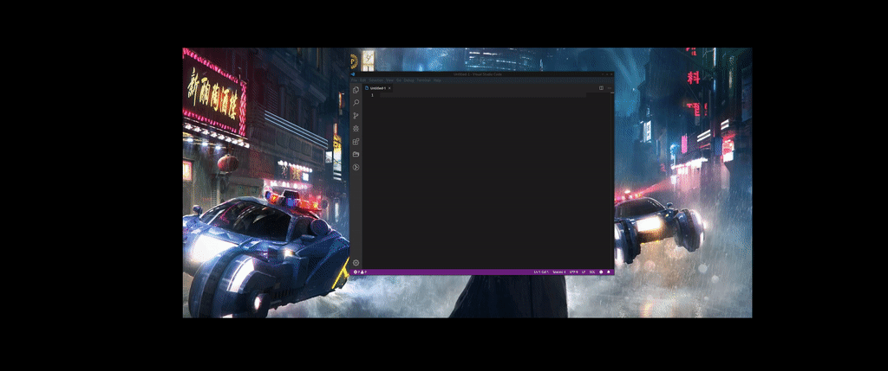

# rofi-gister

Rofi userscript to manage local copies of your gists created by [gister](https://github.com/weakish/gister).

I like using [Dash](https://kapeli.com/dash) to manage code snippets on OSX.  [Lepton](https://github.com/hackjutsu/Lepton) does a good job with managing the snippets, but accessing them leaves something to be desired when compared with Dash's expansion functionality.  I also like using Rofi for a variety of quick tasks, so I wrote this userscript.

## Dependencies

- [rofi](https://github.com/davatorium/rofi)
- [xclip](https://github.com/astrand/xclip)
- [gister](https://github.com/weakish/gister)
- [gist.rb](https://github.com/defunkt/gist)
- [jq](https://stedolan.github.io/jq/)
- [Python 3](https://www.python.org/)

## Installation

### Arch Linux

Install the `rofi-gister-git` package from the [Arch User Repository](https://aur.archlinux.org/).

## Usage

Prior to your first use, use gister to create a local copy of your repository (default location is `~/.gists`)

Optionally, create a file called `.rofi-gister` in your home directory, following the format and keys in the example configuration file in this repository (currently only the path to your gists, and the path to your `gister` script).

Launch the userscript somehow (bind a key to it, launch it from rofi, etc.)

You can search the gist names and descriptions from the rofi window itself, or press `Alt`+`S` to execute a search of the snippet contents.

You can also refresh your local gists with `Alt`+`R`.
